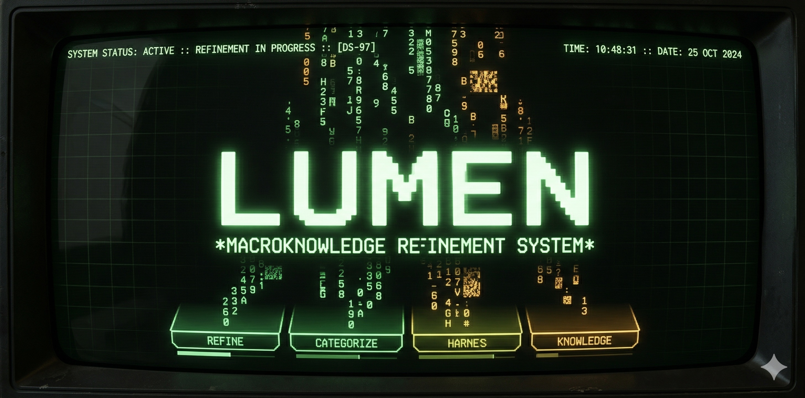

<p align="center">
  
</p>

<h1 align="center">Lumen</h1>

<p align="center">
  <strong>The persistent knowledge keeper for any Git repository.</strong><br>
  An agentic skill that builds, maintains, and serves structured documentation — for both humans and AI agents.
</p>

<p align="center">
  <code>/lumen init</code> · <code>/lumen scan</code> · <code>/lumen ingest</code> · <code>/lumen update</code> · <code>/lumen status</code> · <code>/lumen rules</code> · <code>/lumen &lt;question&gt;</code>
</p>

---

## What is Lumen?

Lumen is an agentic persona that acts as the living memory of a codebase. It accumulates, structures, and serves project knowledge across sessions — so every future interaction starts informed, not from scratch.

It produces three things:

1. **Documentation** (`docs/`) — structured markdown files, committed to Git
2. **Rule files** — for Cursor (`.cursor/rules/lumen.mdc`), Claude Code (`.claude/rules/lumen.md`), and Codex (`AGENTS.md`) — so any AI agent reads the docs before acting
3. **Raw data inbox** (`docs/raw_data/`) — local staging area for ingesting meeting notes, emails, screenshots, and specs

## Principles

- **Code is the source of truth.** Docs point to it, never duplicate it.
- **Concise over comprehensive.** Each doc earns its existence.
- **Pointers over explanations.** Link to `file:function()`, don't re-describe code.
- **Mermaid diagrams** for architecture, data flow, and sequences.
- **One level of depth per document.** `AGENTS.md` → topic docs → code.

## Commands

| Command | What it does |
|---------|-------------|
| `/lumen init` | Build a project fingerprint and bootstrap the docs structure |
| `/lumen scan` | Analyze code and generate/update documentation (with parallel agents) |
| `/lumen ingest` | Absorb raw files (transcripts, emails, screenshots, docs) into structured docs |
| `/lumen update` | Incremental sync from recent git commits |
| `/lumen status` | Show documentation coverage, freshness, and gaps |
| `/lumen rules` | Install rule files for Cursor, Claude Code, and Codex |
| `/lumen <question>` | Query the documentation in natural language |

## Project Fingerprint

Instead of sizing projects as small/medium/large by package count, Lumen builds a
**multidimensional fingerprint** that captures:

- **Project type** — API service, frontend, CLI, library, IaC, data pipeline, monorepo, etc.
- **Complexity signals** — entry point count, integration density, domain complexity, language diversity
- **Maturity signals** — repo age, existing docs, test coverage, CI/CD, contributor count

The fingerprint drives which documents to create, which components to scan, and at
what depth. An empty repo triggers **bootstrapping mode** — Lumen asks what you're
planning to build and creates a provisional structure.

## Document Structure

Lumen generates a `docs/` hierarchy tailored to the project's nature. The fingerprint
determines which documents earn their place.

```
AGENTS.md                       # Entry point — project overview + doc index
docs/
├── high-level-design.md        # Architecture, component map, key decisions
├── <component>/                # Per-component folder
│   ├── README.md               # Component deep dive
│   ├── api.md                  # API surface (if applicable)
│   └── data-model.md           # Data model (if applicable)
├── api.md                      # Global API reference
├── data-model.md               # Database schema, entities, migrations
├── integrations.md             # External services and third-party dependencies
├── codestyle.md                # Naming, patterns, idioms
├── rationale.md                # Non-obvious decisions with reasoning (ADR format)
├── deployment.md               # Build, deploy, CI/CD, monitoring
└── raw_data/                   # Local inbox for /lumen ingest
```

## Scan Depths

Not every component deserves the same documentation effort. Lumen assigns a scan
depth to each component based on its role and complexity:

| Depth | When | What it produces |
|-------|------|-----------------|
| **Deep** | Core domain, complex logic, high integration density | Full README, diagrams, flows, rationale discovery |
| **Standard** | Clear responsibility, moderate complexity | README with key files, dependencies, one primary flow |
| **Light** | Thin wrappers, adapters, config modules | 3–5 line README pointing to source |

## Parallel Scan

For repos with 3+ components, `/lumen scan` uses a three-phase orchestration model:

1. **Fingerprint, Plan & Global Scan** — build/load fingerprint, assign scan depths, write global docs
2. **Parallel Discovery** — one subagent per component with depth-specific prompts, writing concurrently to isolated paths
3. **Synthesize** — cross-reference, validate quality, consolidate integrations, report results

Batching is adaptive: up to 5 components at once, larger repos in groups of 5.

## Knowledge Ingestion

`/lumen ingest` processes files dropped into `docs/raw_data/` (transcripts, emails,
screenshots, documents). Knowledge is **absorbed, not referenced** — raw files are
gitignored, so the extracted information is woven directly into existing docs. Decisions
not yet implemented go into `rationale.md`; future plans and ideas get dedicated
sections in the most relevant doc.

## Rationale Discovery

During deep scans, Lumen flags code that looks unusual or contrary to best practices.
Instead of assuming it's a mistake, it proposes hypotheses to the user and captures
confirmed rationale in `docs/rationale.md` using ADR format.

## Rule Files

`/lumen rules` installs rule files for multiple AI coding tools from a single source
of truth (`assets/lumen-rule.md`):

| Tool | Location | Format |
|------|----------|--------|
| Cursor | `.cursor/rules/lumen.mdc` | MDC with YAML frontmatter (`alwaysApply: true`) |
| Claude Code | `.claude/rules/lumen.md` | Plain markdown (unconditional) |
| Codex | `AGENTS.md` | Reads it directly |

The install script (`scripts/install-rules.sh`) handles the copying. `CLAUDE.md` is
symlinked to `AGENTS.md` so both Codex and Claude Code see the same content.

## Installation

Copy the `skills/lumen/` folder into your agent's skills directory:

```bash
# Claude Code
cp -r skills/lumen/ .claude/skills/lumen/

# Kiro
cp -r skills/lumen/ .kiro/skills/lumen/
```

Then invoke with any `/lumen` command.

## File Layout

```
skills/lumen/
├── SKILL.md                        # Main skill definition
├── assets/
│   └── lumen-rule.md               # Static rule content (single source of truth)
├── scripts/
│   └── install-rules.sh            # Copies rules to Cursor, Claude Code locations
└── references/
    ├── project-fingerprint.md      # Project profiling and documentation strategy
    ├── templates.md                # Document templates (AGENTS.md, HLD, component, API, etc.)
    ├── scan-guide.md               # What to scan, what to document, what to skip
    ├── scan-parallel.md            # Parallel orchestration and depth-specific agent prompts
    ├── ingest-guide.md             # Processing rules for raw data ingestion
    ├── init-template.md            # Init directory structure and stub contents
    └── agents-template.md          # Rule file guide (formats, procedure, AGENTS.md section)
```

## License

MIT
