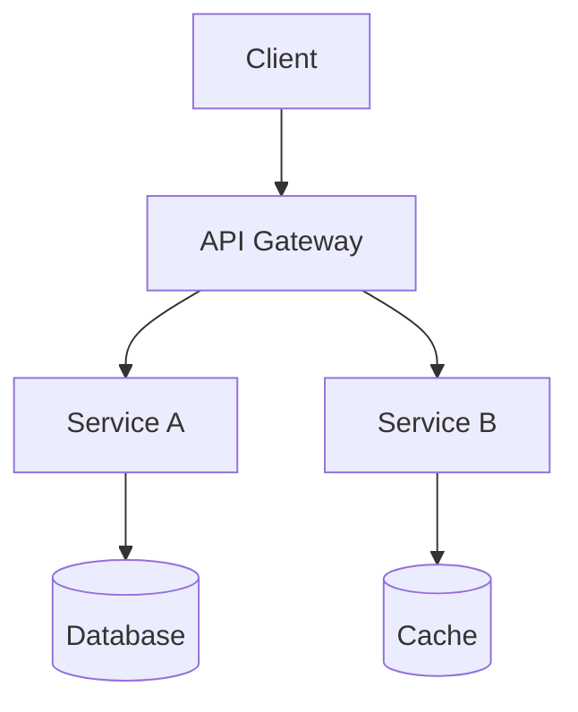
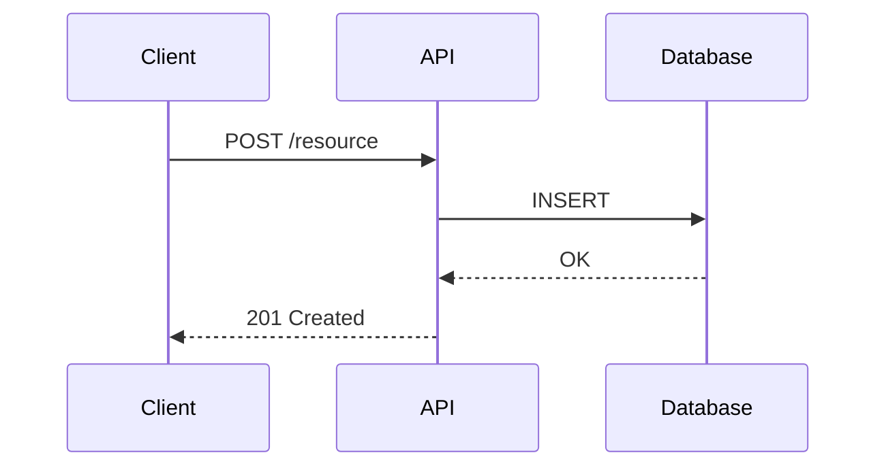
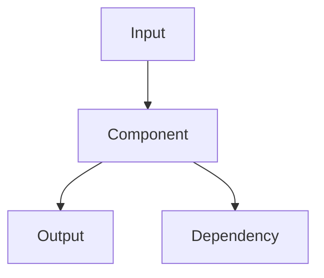
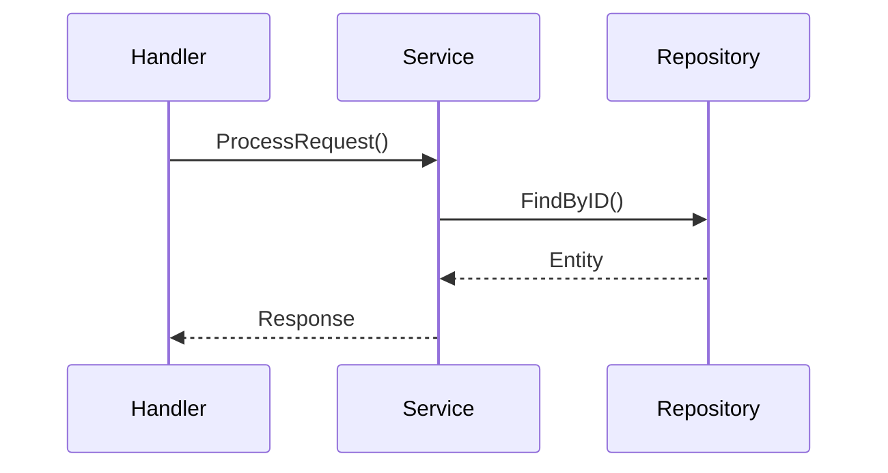
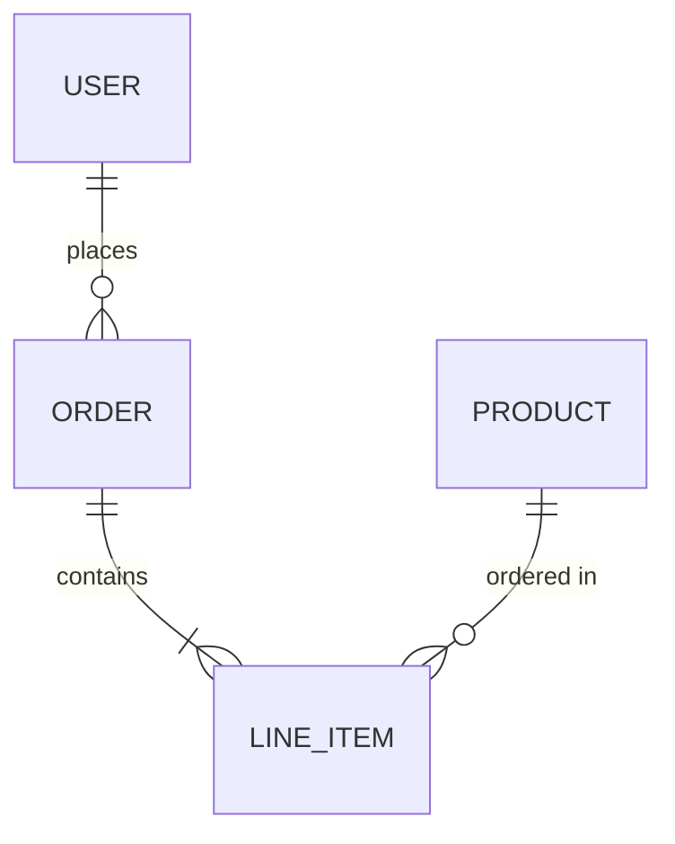
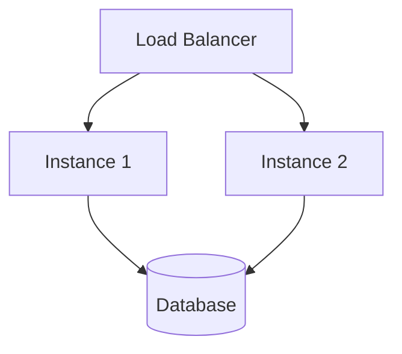

# Document Templates

Ready-to-fill templates for each document type. Read this file during `/lumen scan`
and `/lumen rules`.

---

## AGENTS.md Template

```markdown
# <Project Name>

<1-2 sentence description of what this project does.>

## Tech Stack

- **Language:** ...
- **Framework:** ...
- **Database:** ...
- **Messaging:** ...
- **Deployment:** ...

## Project Structure

<Brief description of top-level directory layout.>

```
├── src/           # ...
├── pkg/           # ...
├── cmd/           # ...
├── docs/          # Project documentation
└── ...
```

## Key Entry Points

- **Main entrypoint:** `cmd/main.go`
- **Config loading:** `src/config/config.go`
- **HTTP routes:** `src/routes/router.go`
- ...

## Documentation Index

- [High-Level Design](docs/high-level-design.md) — Architecture and key decisions
- [Component Name](docs/component-name/) — Component deep dive
- [API](docs/api.md) — API endpoints and contracts
- [Data Model](docs/data-model.md) — Database schema and data flows
- [Code Style](docs/codestyle.md) — Naming conventions, comments, idioms
- [Rationale](docs/rationale.md) — Non-obvious decisions with reasoning
- [Deployment](docs/deployment.md) — Build, deploy, infrastructure

## Development

<Brief: how to build, run, test. Keep to essentials.>

## Configuration

<Key env vars or config files.>

- `PORT` — HTTP listen port (default: `8080`)
- ...

## Metadata

| Field | Value |
|-------|-------|
| **Last scan** | <YYYY-MM-DD> |
| **Last update commit** | <short SHA> |
| **Lumen version** | 1.0 |
```

---

## High-Level Design Template

```markdown
# High-Level Design

<1-2 sentence summary of the system's purpose and architecture style.>

## Architecture Overview

<Mermaid diagram showing main components and their relationships.>



## Components

- **Service A** — Handles X → `src/service-a/`
- **Service B** — Handles Y → `src/service-b/`
- ...

## Key Design Decisions

- **Auth strategy:** JWT — Stateless, scales horizontally
- ...

## Data Flow

<Sequence diagram for the most important flow.>



## Cross-Cutting Concerns

- **Error handling:** <brief description or link>
- **Logging:** <brief description or link>
- **Authentication:** <brief description or link>

## Related Documents

- [Component A](component-a/)
- [Component B](component-b/)
```

---

## Component README Template

```markdown
# <Component Name>

<1-2 sentence summary: what this component does and why it exists.>

## Responsibility

<What this component owns. What it does NOT own (boundaries).>

## Architecture



## Key Files

- `src/component/handler.go` — HTTP handlers
- `src/component/service.go` — Business logic
- `src/component/repo.go` — Data access
- ...

## Key Interfaces / Types

<Main interfaces, structs, or types that define this component's contract. Point to source.>

- `Handler` — HTTP handler interface → `src/component/handler.go:15`
- `Service` — Business logic → `src/component/service.go:22`

## Flows

### <Primary Flow Name>



## Configuration

- `...` — ... (default: `...`)

## Dependencies

- **Internal:** <list internal dependencies>
- **External:** <list external services/APIs>

## Error Handling

<How errors are handled, propagated, or reported in this component.>

## Related Documents

- [High-Level Design](../high-level-design.md)
- [Related Component](../related-component/)
```

---

## API Document Template

```markdown
# API Reference

<1 sentence: what API this covers and its base path.>

## Authentication

<How to authenticate. Token format, header name, etc.>

## Endpoints

### `POST /api/v1/resource`

<Short description.>

**Request:**
```json
{
  "field": "value"
}
```

**Response (201):**
```json
{
  "id": "uuid",
  "field": "value"
}
```

**Errors:**

- `400` — Invalid input
- `401` — Unauthorized
- `404` — Resource not found

**Implementation:** `src/handler/resource.go:Create()`

---

### `GET /api/v1/resource/:id`

<Repeat pattern for each endpoint.>

## Common Error Format

```json
{
  "error": {
    "code": "VALIDATION_ERROR",
    "message": "field X is required"
  }
}
```
```

---

## Data Model Template

```markdown
# Data Model

<1 sentence: what data this system manages.>

## Entity Relationship



## Tables / Collections

### `users`

- `id` (UUID, PK) — User identifier
- `email` (VARCHAR(255), UNIQUE, NOT NULL) — Login email
- `created_at` (TIMESTAMP, NOT NULL) — Creation timestamp

**Defined in:** `migrations/001_create_users.sql`

### `orders`

<Repeat for each table.>

## Indexes

- `idx_users_email` on `users(email)` — Login lookup

## Migrations

- `migrations/001_create_users` — Initial user table
- `migrations/002_add_orders` — Order and line item tables
```

---

## Code Style Template

```markdown
# Code Style

<1 sentence: how code style is managed in this project.>

## Style Tooling

<If linter/formatter configs exist, list them here and skip sections they already cover.>

- **Formatter:** `.prettierrc` — handles spacing, line length, quotes
- **Linter:** `.eslintrc` — enforces import order, unused vars, etc.
- **Editor config:** `.editorconfig` — indent style, trailing whitespace

> Sections below only document conventions **not enforced by tooling**.

## Naming Conventions

### Files & Directories

- <pattern, e.g. "kebab-case for files, PascalCase for React components">

### Variables & Functions

- <pattern, e.g. "camelCase for functions, UPPER_SNAKE for constants">
- <domain-specific prefixes/suffixes, e.g. "repositories suffixed with `Repo`">

### Types & Interfaces

- <pattern, e.g. "PascalCase, no `I` prefix for interfaces">

## Comments

- <when to comment: non-obvious intent, trade-offs, constraints — never narrate what the code does>
- <doc comment style, e.g. "JSDoc for public APIs", "godoc format">

## Code Organization

- <file structure patterns, e.g. "one exported type per file", "group by feature not layer">
- <import ordering, e.g. "stdlib → external → internal, blank line between groups">

## Error Handling

- <pattern, e.g. "return errors, don't panic", "use custom error types from `pkg/errors`">

## Idioms & Patterns

- <project-specific patterns, e.g. "constructor functions named `New<Type>`">
- <anti-patterns to avoid>

## Related

- [High-Level Design](high-level-design.md)
```

---

## Rationale Template

```markdown
# Rationale

Non-obvious decisions in this project that deviate from common patterns or best
practices, with reasoning.

> Built incrementally during codebase exploration. Each entry captures something
> that looks unusual and why it exists.

---

### <Short Decision Title>

- **Date:** YYYY-MM-DD
- **Status:** active | superseded | deprecated
- **Context:** <What problem or constraint led to this decision>
- **Decision:** <What was chosen>
- **Alternatives considered:** <What else was evaluated and why rejected>
- **Rationale:** <Why this choice, despite not being the obvious/standard approach>

---

### <Another Decision>

...
```

---

## Deployment Template

```markdown
# Deployment

<1 sentence: how this project is built, deployed, and run.>

## Build

```bash
# Build command
make build
```

## Run Locally

```bash
# Local development
make dev
```

## Environment

- `DATABASE_URL` (required) — Postgres connection
- `PORT` — HTTP port (default: `8080`)

## Infrastructure



## CI/CD

<Pipeline description: what triggers builds, what runs, where it deploys.>

## Monitoring

- **Health check:** `GET /health`
- **Metrics:** <where/how>
- **Logs:** <where/how>
```
